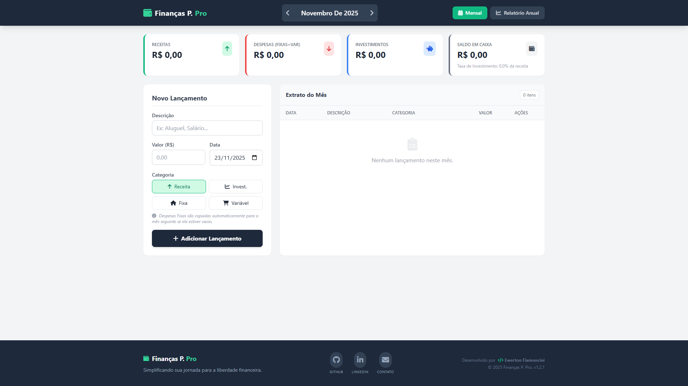
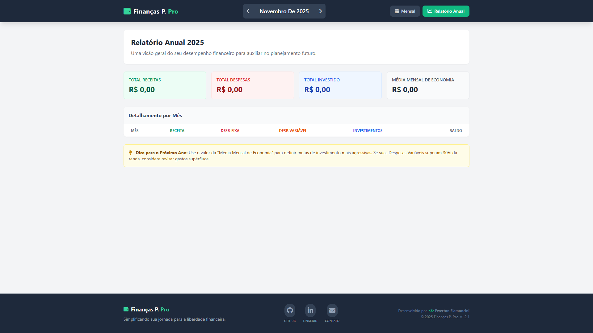

# 💰 Finanças P. Pro - Controle Financeiro Pessoal

Uma aplicação web **Single Page Application (SPA)** leve e responsiva para gerenciamento de finanças pessoais. O projeto permite o controle de receitas, despesas (fixas e variáveis) e investimentos, oferecendo uma visão clara da saúde financeira através de relatórios mensais e anuais.

Tudo roda diretamente no navegador, utilizando **Local Storage** para persistência dos dados, sem necessidade de banco de dados ou backend complexo.

---

## 📸 Screenshots

  
  

---

## ✨ Funcionalidades

### 📊 Gestão Financeira
- **Dashboard Mensal:** Resumo visual de Receitas, Despesas, Investimentos e Saldo em Caixa.
- **Categorização Inteligente:**
  - 🟢 **Receitas:** Salários, rendas extras.
  - 🔴 **Despesas Fixas:** Aluguel, internet (Copiadas automaticamente para o mês seguinte).
  - 🟠 **Despesas Variáveis:** Mercado, lazer.
  - 🔵 **Investimentos:** Aportes mensais (Calcula a taxa de poupança).
- **CRUD Completo:** Adicionar, Editar e Excluir lançamentos.

### 📈 Relatórios e Análises
- **Relatório Anual:** Tabela detalhada mês a mês com totais acumulados.
- **Indicadores:** Cálculo automático da taxa de economia mensal.
- **Navegação Temporal:** Alterne facilmente entre meses e anos.

### 🛠️ Usabilidade e Design
- **100% Responsivo:** Funciona perfeitamente em Desktop e Mobile.
- **Design Moderno:** Interface limpa construída com Tailwind CSS.
- **Feedback Visual:** Modais de confirmação e notificações (Toasts).
- **Persistência de Dados:** Salva tudo automaticamente no navegador do usuário.

---

## 🚀 Tecnologias Utilizadas

Este projeto foi construído utilizando tecnologias web padrão, sem a necessidade de frameworks pesados de JavaScript (como React ou Vue), tornando-o extremamente leve e fácil de hospedar.

*  **HTML5 Semântico**
*  **Vanilla JS (ES6+)**
*  **Tailwind CSS (via CDN)**
*  **Ícones**

---

## 📦 Como Usar

Não é necessário instalação de servidores (Node, PHP, Python).

Abre o Site: [Finança P. Pro](https://ewefiamoncini.github.io/financP-pro/)

> **Nota:** Como os dados são salvos no `LocalStorage` do navegador, se você limpar o cache do navegador ou abrir em modo anônimo, os dados não estarão lá. Para uso em produção, recomenda-se fazer backup dos dados periodicamente (funcionalidade futura).

---

## 🎨 Estrutura de Categorias

O sistema utiliza cores para facilitar a identificação visual:

| Categoria | Cor | Descrição |
| :--- | :--- | :--- |
| **Receita** | Verde | Dinheiro entrando na conta. |
| **Despesa Fixa** | Vermelho | Contas recorrentes. O sistema sugere copiá-las ao mudar de mês. |
| **Despesa Variável** | Laranja | Gastos pontuais do dia a dia. |
| **Investimento** | Azul | Dinheiro guardado/aplicado para o futuro. |

---

## 🤝 Contribuindo

Contribuições são sempre bem-vindas! Se você tem uma ideia para melhorar o app:

1.  Faça um **Fork** do projeto.
2.  Crie uma **Branch** para sua feature (`git checkout -b feature/NovaFeature`).
3.  Faça o **Commit** (`git commit -m 'Adicionando NovaFeature'`).
4.  Faça o **Push** (`git push origin feature/NovaFeature`).
5.  Abra um **Pull Request**.

---

## 👤 Autor

**Ewerton Fiamoncini**

* Github: [@EweFiamoncini](https://github.com/EweFiamoncini)
* LinkedIn: [Ewerton Fiamoncini](https://www.linkedin.com/in/ewertonfiamoncini/)
* Email: ewertonfiamoncini20@gmail.com

---

## 📄 Licença

Este projeto está sob a licença MIT. Veja o arquivo [LICENSE](LICENSE.md) para mais detalhes.

---

  Feito com ❤️ por Ewerton Fiamoncini

